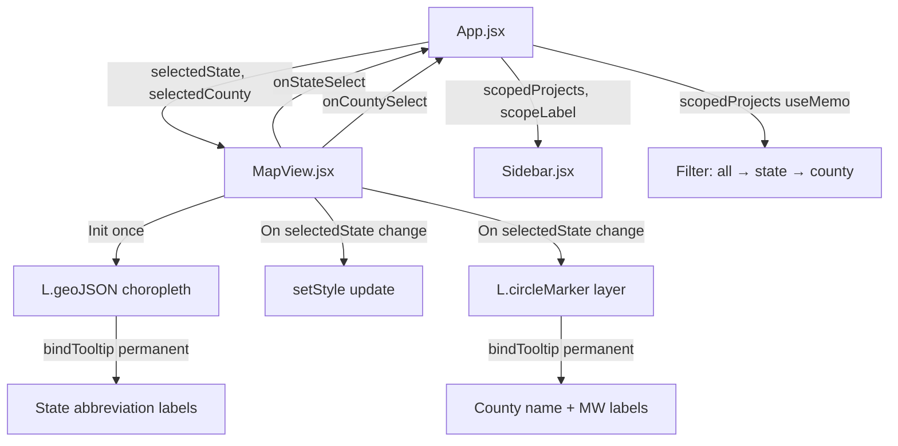

# Learnings — Leaflet + React Map Interactivity

## 1. `className` in Leaflet GeoJSON Style Kills Pointer Events

> [!CAUTION]
> Setting `className` in L.geoJSON `style()` options causes Leaflet to apply `pointer-events: none` on all SVG `<path>` elements. This silently makes every state polygon unclickable.

**What happened**: Our choropleth style included `className: 'choropleth-state'` for CSS cursor styling. Leaflet interprets `className` as a signal that the path is decorative, not interactive.

**Fix**: Remove `className` from style options entirely. Apply cursor via `.leaflet-interactive { cursor: pointer !important; }` in CSS. Also add safety overrides:
```css
.leaflet-overlay-pane svg path { pointer-events: auto !important; }
```

---

## 2. `L.divIcon` Markers Get Mispositioned in Flex Layouts

> [!WARNING]
> Leaflet's marker pane (`leaflet-marker-pane`) calculates marker positions relative to the map container's offset from the document root. In complex CSS flex layouts, this calculation can be off by hundreds of pixels.

**What happened**: State labels and county bubbles (all using `L.divIcon` / `L.marker`) rendered ~1400px below the map viewport. The DOM elements existed but were invisible because they were off-screen.

**Why `invalidateSize()` didn't help**: The issue isn't container size but the coordinate transform between the SVG overlay pane and the marker (HTML) pane. These use different positioning strategies internally.

**Fix**: Use SVG-based alternatives that render in the same pane as GeoJSON paths:

| Need | Bad (divIcon) | Good (SVG-based) |
|------|---------------|-------------------|
| State labels | `L.marker` + `L.divIcon` | `layer.bindTooltip(text, { permanent: true, className: '...' })` |
| County bubbles | `L.marker` + `L.divIcon` | `L.circleMarker([lat, lng], { radius, fillColor, ... })` |

SVG-based elements share the same coordinate system as GeoJSON paths and never have offset issues.

---

## 3. Stale Closures: Leaflet Event Handlers vs React State

> [!IMPORTANT]
> Leaflet event handlers capture variables at bind-time. If you bind handlers inside a `useEffect` that depends on React state, the handlers will always see the state value from when they were created — not the current value.

**Pattern — Callback Refs**:
```jsx
const cbRefs = useRef({});
cbRefs.current = { onStateSelect, onCountySelect }; // Updated every render

// In Leaflet handler (bound once):
layer.on('click', () => {
    cbRefs.current.onStateSelect?.(abbr); // Always calls latest
});
```

**Pattern — State Refs** (for reading React state inside Leaflet handlers):
```jsx
const selectedStateRef = useRef(selectedState);
selectedStateRef.current = selectedState; // Updated every render

// In Leaflet handler:
const isSel = selectedStateRef.current === abbr; // Always reads latest
```

---

## 4. Don't Rebuild Layers on State Change

> [!WARNING]
> If a `useEffect` that creates a Leaflet layer includes React state in its dependency array, every state change will tear down and rebuild the entire layer — destroying all event handlers and causing visual flicker.

**Bad**:
```jsx
useEffect(() => {
    const layer = L.geoJSON(data, { onEachFeature: ... });
    layer.addTo(map);
    return () => map.removeLayer(layer);
}, [selectedState]); // Rebuilds on every click!
```

**Good**: Create layer once (empty deps), update styles separately:
```jsx
useEffect(() => { /* create layer, bind events */ }, []);          // Once
useEffect(() => { choroplethRef.current.setStyle(...); }, [selectedState]); // Style only
```

---

## 5. Data Granularity: County, Not City

The gridstatus API (`CAISO`, `ERCOT`, `NYISO`, `PJM`, `MISO`, `SPP`, `ISONE`) provides these geographic fields:
- `County` ✅ (always present for US projects)
- `State` ✅ (2-letter abbreviation)
- `City` ❌ (does not exist in any ISO's data)

County is the finest geographic granularity available for US interconnection queue data. The ingest script ([gridstatus_puller.py](file:///Users/arshaq/.gemini/antigravity/playground/silent-tyson/server/ingest/gridstatus_puller.py)) correctly maps `county` and `state` from the raw data. The DB also has a pre-computed `county_summaries` table.

---

## 6. Architecture Summary



**Data flow**: User clicks state → `cbRefs.current.onStateSelect(abbr)` → App sets `selectedState` → `scopedProjects` useMemo filters → Sidebar re-renders with scoped data. MapView's `setStyle` effect highlights the selected state. County circleMarkers appear via a separate effect.

---

## 7. Key Files Modified

| File | What Changed |
|------|-------------|
| [MapView.jsx](file:///Users/arshaq/.gemini/antigravity/playground/silent-tyson/src/components/MapView.jsx) | Full rewrite: init-once pattern, cbRefs, bindTooltip labels, circleMarker counties |
| [App.jsx](file:///Users/arshaq/.gemini/antigravity/playground/silent-tyson/src/App.jsx) | `scopedProjects`, `scopeLabel`, `handleStateSelect`, `handleCountySelect` |
| [Sidebar.jsx](file:///Users/arshaq/.gemini/antigravity/playground/silent-tyson/src/components/Sidebar.jsx) | Reacts to `scopedProjects` and `scopeLabel` |
| [index.css](file:///Users/arshaq/.gemini/antigravity/playground/silent-tyson/src/index.css) | `pointer-events` overrides, tooltip label styles |
