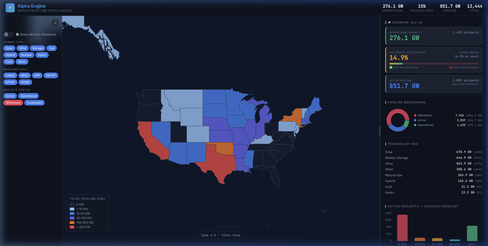
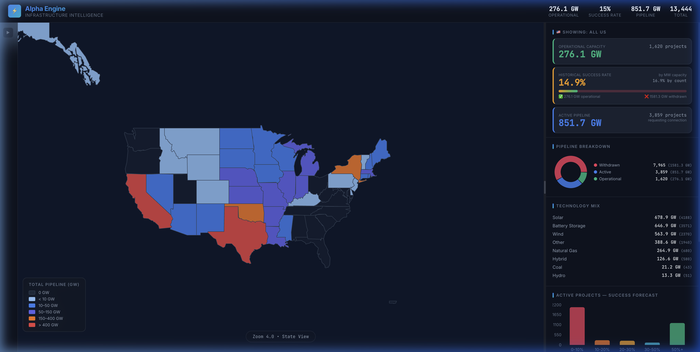

# Alpha Engine — Infrastructure Intelligence

A full-stack investor dashboard for U.S. power infrastructure interconnection queues. Tracks **13,000+** energy projects across 6 ISOs, providing real-time capacity analysis, historical success rates, and pipeline forecasting.

## What It Does

Alpha Engine ingests interconnection queue data from major U.S. grid operators (CAISO, MISO, SPP, ERCOT, NYISO, ISONE) and presents it as an interactive investor-focused dashboard with:

- **Choropleth Map** — 50-state heatmap colored by total pipeline capacity (GW), with state-level drill-down and county-level detail
- **Investor Metrics** — Operational capacity, historical success rate (MW-weighted), and active pipeline capacity
- **Filters** — Power type (Solar, Wind, Storage, etc.), ISO provider, and project status
- **Success Scoring** — ML-based probability scoring for active projects based on historical completion patterns
- **Phantom Detection** — Flags speculative/placeholder projects to filter noise from genuine capacity requests

### Dashboard View (Expanded)


### Dashboard View (Map Focus)


## Architecture

```
┌─────────────────────────────────────────────────────┐
│  React Frontend (Vite)                              │
│  Leaflet Map · Recharts · Investor Dashboard        │
├─────────────────────────────────────────────────────┤
│  FastAPI Backend                                    │
│  REST API · Background Ingestion · SQLite           │
├─────────────────────────────────────────────────────┤
│  Data Pipeline                                      │
│  gridstatus → Geocode → Score → Aggregate           │
└─────────────────────────────────────────────────────┘
```

| Layer    | Tech                    | Location        |
|----------|-------------------------|-----------------|
| Frontend | React 19, Vite 7, Leaflet, Recharts | `src/`    |
| Backend  | FastAPI, Uvicorn        | `server/main.py` |
| Database | SQLite                  | `server/interconnection_queue.db` |
| Pipeline | gridstatus, pandas      | `server/run_pipeline.py` |

## Prerequisites

- **Node.js** ≥ 18 (for frontend)
- **Python** ≥ 3.10 (for backend)

## Setup & Data Population

### 1. Install frontend dependencies

```bash
npm install
```

### 2. Set up Python environment

```bash
cd server
python -m venv .venv
source .venv/bin/activate    # macOS/Linux
# .venv\Scripts\activate     # Windows
pip install -r requirements.txt
```

### 3. Populate the database

Run the full data pipeline to pull live data from all ISOs:

```bash
cd server
python run_pipeline.py
```

This runs 4 steps automatically:
1. **Pull** — Downloads interconnection queue data from 6 ISOs via `gridstatus`
2. **Geocode** — Adds lat/lng coordinates to projects using county centroids
3. **Score** — Computes success probability and phantom flags for each project
4. **Aggregate** — Builds state and county summary tables

The pipeline takes ~2-5 minutes and creates `server/interconnection_queue.db`.

**Selective pulls:**
```bash
# Pull specific ISOs only
python run_pipeline.py --iso CAISO ERCOT

# Skip specific steps
python run_pipeline.py --skip-pull    # Use existing data, re-score
python run_pipeline.py --skip-geocode # Skip geocoding step
```

## Starting the Service

You need **two terminals** — one for the backend, one for the frontend.

### Terminal 1: Backend API

```bash
cd server
source .venv/bin/activate
uvicorn main:app --reload --port 8000
```

The API will be live at `http://localhost:8000`. Key endpoints:
- `GET /api/queue/geojson` — All projects as GeoJSON
- `GET /api/queue/summary` — State-level aggregations
- `GET /api/health` — Health check
- `POST /api/ingest/pull-all` — Trigger full data refresh

### Terminal 2: Frontend Dev Server

```bash
npm run dev
```

Open `http://localhost:5173` in your browser. The frontend proxies API calls to the backend automatically (configured in `vite.config.js`).

## Project Structure

```
├── src/                         # React frontend
│   ├── App.jsx                  # Main app + layout + state
│   ├── index.css                # Global styles
│   └── components/
│       ├── MapView.jsx          # Leaflet choropleth map
│       ├── Sidebar.jsx          # Investor metrics panel
│       ├── FilterBar.jsx        # Power type / ISO / status filters
│       └── ProjectDetail.jsx    # Individual project detail modal
├── server/                      # Python backend
│   ├── main.py                  # FastAPI application
│   ├── db.py                    # SQLite schema + queries
│   ├── run_pipeline.py          # Pipeline orchestrator
│   ├── scoring.py               # Success model + phantom detection
│   ├── aggregator.py            # State/county summary builder
│   ├── requirements.txt         # Python dependencies
│   └── ingest/
│       ├── gridstatus_puller.py # ISO data ingestion
│       └── geo_enricher.py      # Geocoding module
├── index.html                   # Entry point
├── vite.config.js               # Vite + proxy config
└── package.json                 # Node dependencies
```

## Data Sources

| ISO    | Coverage             | Projects |
|--------|----------------------|----------|
| CAISO  | California           | ~1,800   |
| MISO   | Midwest              | ~3,200   |
| SPP    | Great Plains         | ~1,100   |
| ERCOT  | Texas                | ~2,700   |
| NYISO  | New York             | ~500     |
| ISONE  | New England          | ~300     |

Data is sourced via the [`gridstatus`](https://github.com/kmax12/gridstatus) Python library, which scrapes public interconnection queue data from each ISO.

## License

Private — for internal use only.
